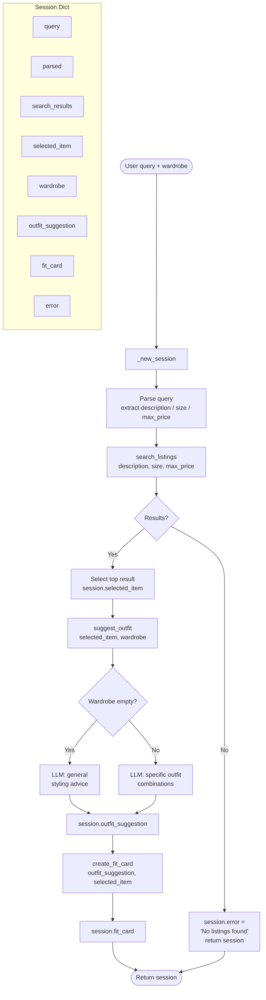

# FitFindr — planning.md

> Complete this document before writing any implementation code.
> Your spec and agent diagram are what you'll use to direct AI tools (Claude, Copilot, etc.) to generate your implementation — the more specific they are, the more useful the generated code will be.
> Your planning.md will be reviewed as part of your submission.
> Update it before starting any stretch features.

---

## Tools

List every tool your agent will use. For each tool, fill in all four fields.
You must have at least 3 tools. The three required tools are listed — add any additional tools below them.

### Tool 1: search_listings

**What it does:**
<!-- Describe what this tool does in 1–2 sentences -->
It takes in details about the clothes user, searches the mock listings dataset and returns matching items. In case of no matching items, it returns a message the inform the user about the no match.

**Input parameters:**
<!-- List each parameter, its type, and what it represents -->
- `description` (str): Details about the piece of clothing that the user want
- `size` (str): clothes size of the user
- `max_price` (float): the maximum amount of money the user is willing to pay

**What it returns:**
<!-- Describe the return value — what fields does a result contain? -->
It returns the matched items in, including the fields: title, description, category, style tags, size, condition, price and color.

**What happens if it fails or returns nothing:**
<!-- What should the agent do if no listings match? -->
In case of failure or no matching item, the agent should return a message saying there is no matching item to the user's need.

---

### Tool 2: suggest_outfit

**What it does:**
<!-- Describe what this tool does in 1–2 sentences -->
Suggest outfit combinations given the input item and the user's wardrobe

**Input parameters:**
<!-- List each parameter, its type, and what it represents -->
- `new_item` (dict): The description of the new item, including every fields of the item except the id 
- `wardrobe` (dict): contains details of all items that the user have

**What it returns:**
<!-- Describe the return value -->
Return a list of dictionaries of outfit combinations. Each dictionary contains the items for an outfit. 

**What happens if it fails or returns nothing:**
<!-- What should the agent do if the wardrobe is empty or no outfit can be suggested? -->
Return a message saying there is no recommended outfit combination.

---

### Tool 3: create_fit_card

**What it does:**
<!-- Describe what this tool does in 1–2 sentences -->
Take output from the suggest outfit_outfit function to generates a short, shareable description of a complete outfit — the kind of thing someone would caption an Instagram post with. Must produce something different each time for different inputs.

**Input parameters:**
<!-- List each parameter, its type, and what it represents -->
- `outfit` (list): a list contains all outfit combinations with the new item 
- `new_item`(dict): all details of the new item

**What it returns:**
<!-- Describe the return value -->
A short, shareable description of a complete outfit — the kind of thing someone would caption an Instagram post with

**What happens if it fails or returns nothing:**
<!-- What should the agent do if the outfit data is incomplete? -->
If the outfit is incomplete, generate a message to the user saying that the new item does not create any outfit combination.

---

### Additional Tools (if any)

<!-- Copy the block above for any tools beyond the required three -->

---

## Planning Loop

**How does your agent decide which tool to call next?**

The agent follows a conditional, state-driven loop — not a fixed sequence. After each step, it inspects the session state before deciding whether to continue or stop early.

1. **Parse first.** The agent starts by parsing the user's natural-language query into structured parameters (`description`, `size`, `max_price`) and stores them in `session["parsed"]`. No tool is called until parsing succeeds.

2. **`search_listings` — always first.** The agent calls `search_listings()` with the parsed parameters. This is the only tool that always runs; the rest are conditional.

3. **Branch on search results.** The agent checks `session["search_results"]`:
   - **Empty list → stop.** The agent sets `session["error"]` to a user-friendly "no matches" message and returns immediately. `suggest_outfit` and `create_fit_card` are never called — there is nothing to style.
   - **Non-empty list → continue.** The agent selects the top-ranked result and stores it in `session["selected_item"]`.

4. **`suggest_outfit` — only if a selected item exists.** The agent calls `suggest_outfit(selected_item, wardrobe)`. The wardrobe may be empty; the tool handles that gracefully by giving general styling advice instead of outfit combinations. The result is stored in `session["outfit_suggestion"]`.

5. **`create_fit_card` — only if an outfit suggestion exists.** The agent checks that `session["outfit_suggestion"]` is a non-empty string before calling `create_fit_card()`. If it is empty or missing (tool failure), the agent sets an error and skips this step. Otherwise it stores the caption in `session["fit_card"]`.

6. **Done when `session["fit_card"]` is set or `session["error"]` is set.** The agent returns the full session dict either way, letting the caller distinguish success from early termination by checking `session["error"]`.

**In short:** each tool call is gated on what the previous tool returned. The agent only advances to the next tool when it has valid, non-empty output to pass forward; otherwise it exits early with an informative error.

---

## State Management

**How does information from one tool get passed to the next?**

All state lives in a single `session` dict created by `_new_session()` at the start of each interaction. No global variables are used — the dict is the only source of truth for the run.

| Field | Set by | Read by |
|---|---|---|
| `session["query"]` | `_new_session()` | parse step |
| `session["parsed"]` | parse step | `search_listings` call |
| `session["search_results"]` | `search_listings` | branch check + item selection |
| `session["selected_item"]` | item selection step | `suggest_outfit` call |
| `session["wardrobe"]` | `_new_session()` (passed in by caller) | `suggest_outfit` call |
| `session["outfit_suggestion"]` | `suggest_outfit` | `create_fit_card` call |
| `session["fit_card"]` | `create_fit_card` | returned to caller |
| `session["error"]` | any early-exit step | caller checks this first |

Each tool is called with values read directly from the session dict, and its return value is written back into the appropriate field before the next step. No tool receives the session dict itself — inputs are unpacked explicitly, keeping each tool independently testable.

---

## Error Handling

For each tool, describe the specific failure mode you're handling and what the agent does in response.

| Tool | Failure mode | Agent response |
|------|-------------|----------------|
| search_listings | No results match the query | Set `session["error"]` to a friendly message (e.g., "No listings found for your search — try different keywords or a higher budget.") and return the session immediately. `suggest_outfit` and `create_fit_card` are never called. |
| suggest_outfit | Wardrobe is empty | The tool itself handles this gracefully: instead of outfit combinations, it asks the LLM for general styling advice for the item (what pairs well, what vibe it suits). The agent stores this advice in `session["outfit_suggestion"]` and continues normally to `create_fit_card`. |
| create_fit_card | Outfit input is missing or incomplete | The tool returns a descriptive error string rather than raising an exception. The agent stores this in `session["fit_card"]` as-is and returns the session — the caller can detect the problem by checking whether `session["error"]` is set or whether the fit card text looks like an error message. |

---

## Architecture

---

## AI Tool Plan

<!-- For each part of the implementation below, describe:
     - Which AI tool you plan to use (Claude, Copilot, ChatGPT, etc.)
     - What you'll give it as input (which sections of this planning.md, your agent diagram)
     - What you expect it to produce
     - How you'll verify the output matches your spec before moving on

     "I'll use AI to help me code" is not a plan.
     "I'll give Claude my Tool 1 spec (inputs, return value, failure mode) and ask it to implement
     search_listings() using load_listings() from the data loader — then test it against 3 queries
     before trusting it" is a plan. -->

**Milestone 3 — Individual tool implementations:**

- **AI tool:** Claude (Cowork)
- **Input:** The Tool 1/2/3 spec sections from this file (inputs, return value, failure mode) plus the relevant stub from `tools.py` and the `load_listings()` signature from `utils/data_loader.py`
- **Expected output:** A complete implementation of each function — `search_listings`, `suggest_outfit`, and `create_fit_card` — matching the docstring contract
- **Verification:** Run each tool independently with at least 3 test inputs before wiring it into the agent:
  - `search_listings`: query that should match, query that should return nothing, query with size/price filters
  - `suggest_outfit`: non-empty wardrobe, empty wardrobe
  - `create_fit_card`: valid outfit string, empty string input

**Milestone 4 — Planning loop and state management:**

- **AI tool:** Claude (Cowork)
- **Input:** The Planning Loop, State Management, Error Handling, and Architecture sections from this file, plus the `_new_session()` stub and the TODOs in `run_agent()` from `agent.py`
- **Expected output:** A complete `run_agent()` implementation that initializes the session, parses the query, calls tools conditionally, propagates state through the session dict, and returns early on errors
- **Verification:** Run the two CLI test cases already in `agent.py` (`__main__` block) — the happy path should produce a fit card, and the no-results path should return a non-None `session["error"]` with no fit card

---

## A Complete Interaction (Step by Step)

Write out what a full user interaction looks like from start to finish — tool call by tool call. Use a specific example query.

**Example user query:** "I'm looking for a vintage graphic tee under $30. I mostly wear baggy jeans and chunky sneakers. What's out there and how would I style it?"

**Step 1:** The agent parses the query. It extracts `description = "vintage graphic tee"`, `max_price = 30.0`, and `size = None` (no size mentioned). These go into `session["parsed"]`.

**Step 2:** The agent calls `search_listings(description="vintage graphic tee", size=None, max_price=30.0)`. The tool loads `data/listings.json`, filters out items over $30, scores remaining items by keyword overlap with "vintage graphic tee", and returns the top matches sorted by score. Suppose it returns 3 listings — a faded band tee at $18, a 90s surf graphic tee at $25, and a tie-dye tee at $22. These are stored in `session["search_results"]`.

**Step 3:** The agent selects the top result (faded band tee, $18) and stores it in `session["selected_item"]`. It then calls `suggest_outfit(new_item=<band tee dict>, wardrobe=<user wardrobe>)`. The user's wardrobe contains baggy jeans and chunky sneakers, so the LLM suggests two outfits: (1) band tee + baggy jeans + chunky sneakers for a grunge-casual look, and (2) band tee tucked into wide-leg cargos with platform boots. The suggestion string is stored in `session["outfit_suggestion"]`.

**Step 4:** The agent calls `create_fit_card(outfit=<suggestion string>, new_item=<band tee dict>)`. The LLM generates a casual Instagram-style caption using higher temperature for variety. Result is stored in `session["fit_card"]`.

**Final output to user:**
The Gradio UI surfaces the fit card caption, the outfit suggestion, and the matched listing details (title, price, platform). Example:

> *thrifted this faded band tee for $18 on Depop and honestly it's doing everything rn 🖤 styled it with my baggy jeans and chunky sneakers for that effortless 90s thing — no notes. vintage finds > fast fashion always.*

Below that, the full outfit breakdown and a link to the listing.
